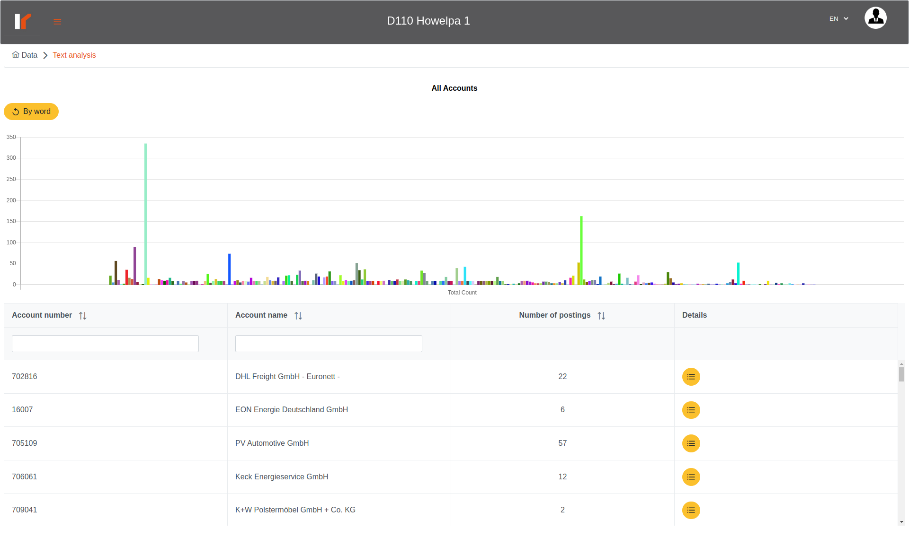
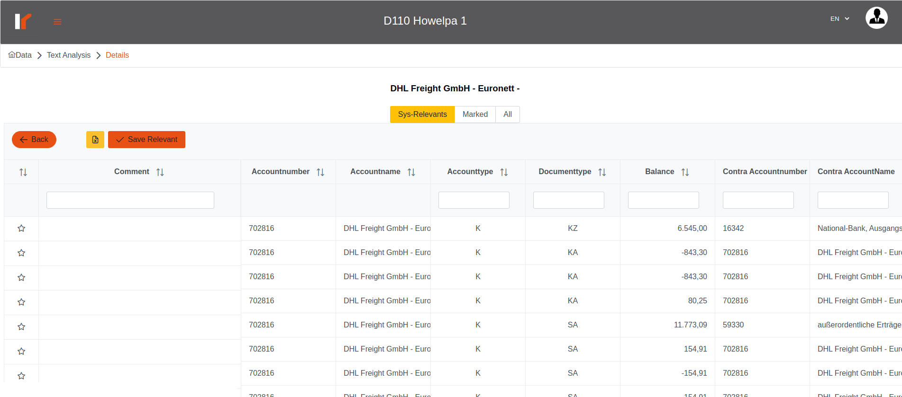
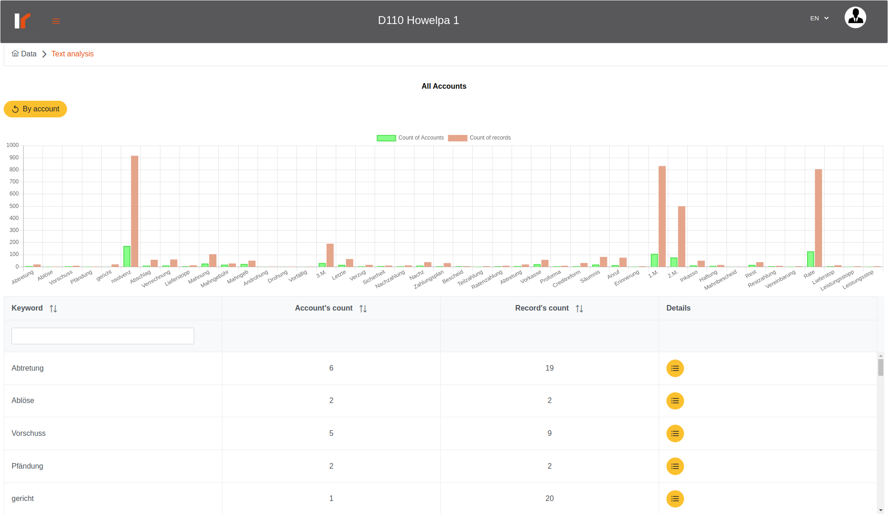

# Venalytics Documentation

## Text analysis

text analysis describes the records that contains one of the flashy words, and there are 2 points here: the first grouping the records by accounts and the other by the keyword it self.

## 1. Text analysis by account

here the chart represents the accounts and the number of flashy records for each account, so we can figure out the most suspicious account.
Here we get the records which contains flashy words in the fields (reference, textPosting, textHeader ) and for creditor accounts only (compared by the original account type only and not by account new type) grouping by account.
For each account you can got to the details where you can examine each record in detail;

here we can see three tables;
the first table display the records that we consider it suspicious;
the third table contains all records for this account;
in the first and third table the user can mark records as most important/ more relevant for the user;
the second table contains the relevant records which marked by the user;
in any table of them you can just write a commit for multi records and click ‘save relevant’ button to save changes;
to unmark records just click on the start (the comment will automatically deleted) then don’t forget to click ‘save relevant’ button to save the changes;

## 2. Text analysis by  word

just like ‘text by account analysis’ but grouped by the keywords.
