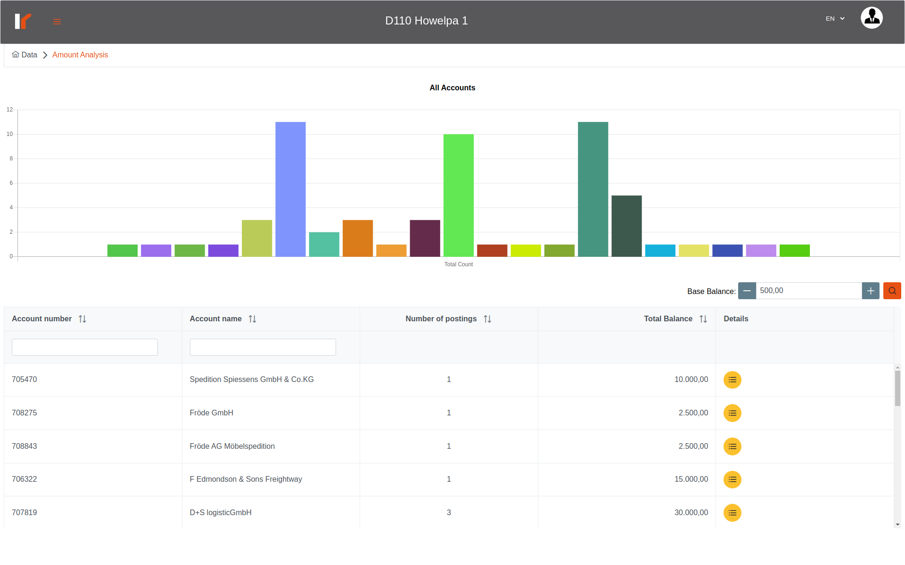
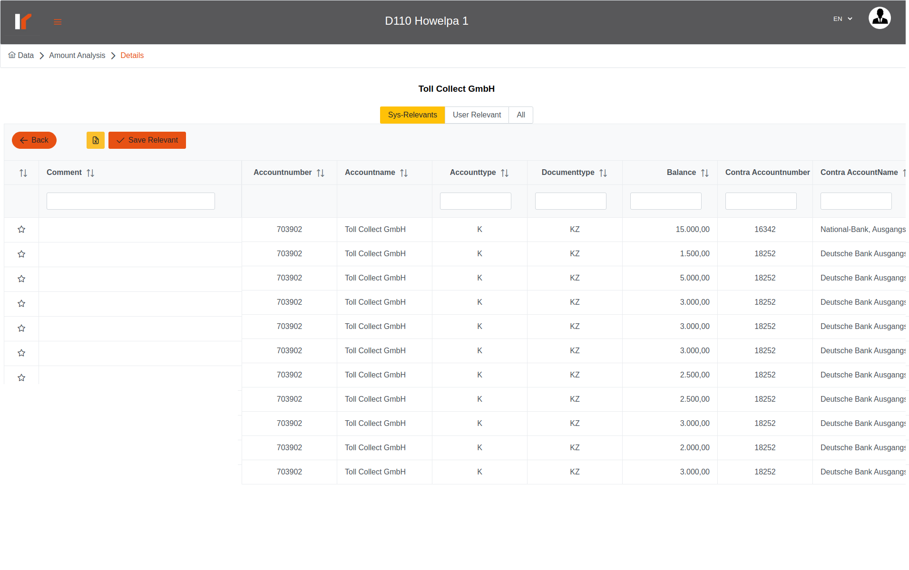

# Venalytics Documentation

## amount analysis

Amount analysis describes the records that contains a flashy values in the balance field, the flashy values are values multiplies a hundred and above a base balance (the default base balance is 500) like: 600,00. the analysis grouped by account.

here the chart represents the accounts and the number of flashy records for each account, so we can figure out the most suspicious account.
For each account you can got to the details where you can examine each record in detail;

here we can see three tables;
the first table display the records that we consider it suspicious;
the third table contains all records for this account;
in the first and third table the user can mark records as most important/ more relevant for the user;
the second table contains the relevant records which marked by the user;
in any table of them you can just write a commit for multi records and click ‘save relevant’ button to save changes;
to unmark records just click on the start (the comment will automatically deleted) then don’t forget to click ‘save relevant’ button to save the changes;
