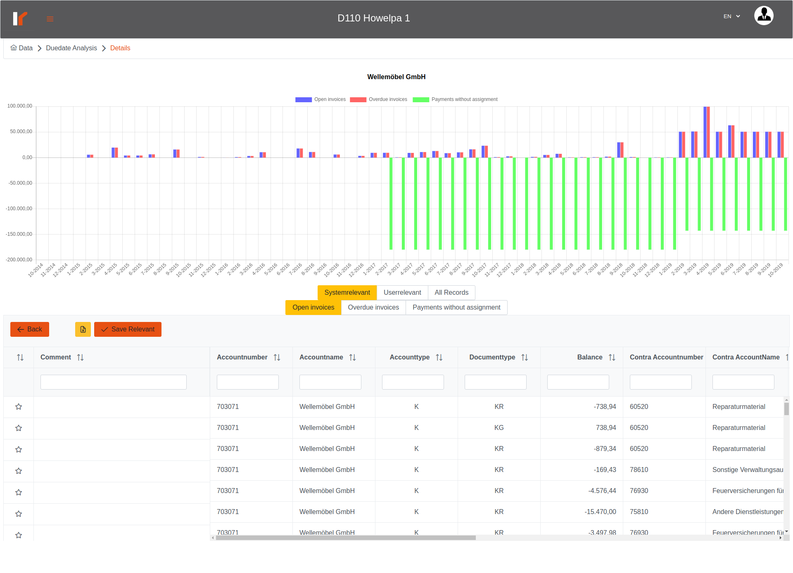
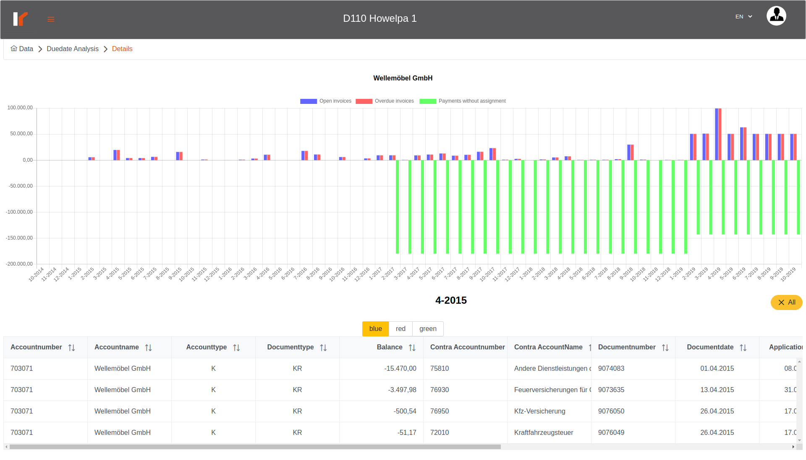

# Venalytics Documentation

## Payment analysis

Payment analysis describes the delayed or unpaid records.
The blue color represents the delayed but not overdue records (open invoices), the red color represents the overdue records and the green color represents the unpaid records till now (payments without assignment).

### The ‘all Accounts’ chart

represent the invoices state for the selected procedure, so the open invoices value for a specific month is: the sum of all open invoices (blue) records’ balances for all creditors accounts in the selected procedure; and it’s the same for the overdue and not paid values.

### The ‘top 10’

the tables on the left represent the top 10 values of each category (open invoices, overdue and not paid) separated in tabs, so you can click on he each tab to display the top 10 of each category, then you can click on an account to display a chart for the selected account; you can see the account; name displayed above the chart;
to back to all accounts you can click again on the selected account.

### The ‘all accounts’ table

the table in the bottom represents each account and the value of each category regardless the time (monthly claculated in the previous charts);

here for each account you can click on the ‘three bars’ button to go to the details page to see every records calculated in this table for the specific -selected- account;

## Details Page

in the top we can see the name of the selected account;
the chart represents the values for this selected account;
the tables in the bottom: 
    1. all records tab: you can see the all records for the selected account regardless the relevance of the record (open invoices and not open); but the user can set a record as relevant record;
    2. System relevant tab: contains three tabs -tables-, each table represent the records that conform a specific category (open invoices, overdue and not paid) regardless the time; and the user can set records as a user relevant to set them as important records;
    3. user relevant tab: here the user can see just the records that the user marked them as relevant.
To set record as relevant you can just write a commit or just click on the start, you can mark multiple records then click on ‘save relevant’ button;
to unset records, just click on the marked (filled) stars, and then click on the ‘save relevant’ button;
you can set and unset relevant records in the same operation.

### Specific month data

to display the records for a specific month, just click on a bar in the main chart;

to go back to the all time data, just click on the ‘All’ button on the right of the selected month title.
