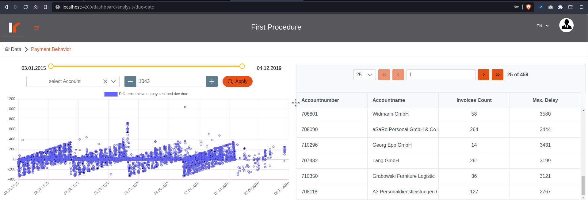
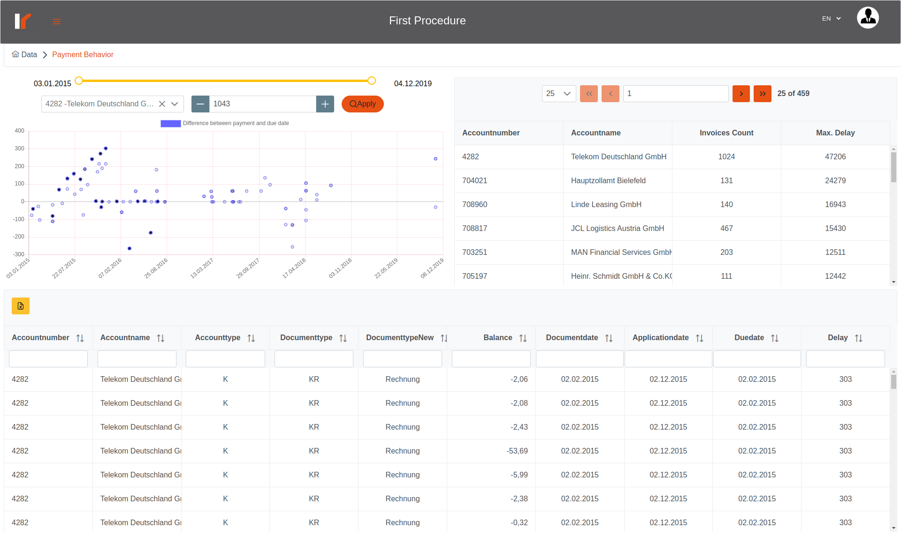

# Venalytics Documentation

## Due Date analysis

Due Date analysis describes the delay in the selected procedure (the difference between ‘when they should be paid’ and ‘when they did been paid’) so more the difference is bigger the more situation is worst!


### Right table

contains the delayed accounts ordered by delay time(in days) from the top to the end.

the scatter chart display the amount of delay for  each record for this procedure;
the filters above the chart can determine the date range and a max delay to ignore records which exceeds this value;
and you can select an account by 2 ways:

1. select specific account from the filter above the chart;
2. click on a record in the right table.

once an account selected, a table of the selected account will appears below.

you can export this table as Excel file using the yellow button on the top-left on the table.

## Due Date analysis Details page

Deleted in this release; all the account details now displayed in the main interface page.

## Code Reference

So due date analysis in this release has 3 primary functions:

1. get scatter chart data;
2. get top delayed accounts table data;
3. get data for specific account.

other functionalities are deleted.

### Frontend

the component responsible for the main page is:

```bash
Code/front-end/src/app/shared/analysis/payment-analysis/due-date/due-date.component.ts
```

 and the details component in the same folder should be deleted in the next code refactory.
the component uses the analysis service like other analysis:

```bash
Code/front-end/src/app/shared/service/analysis.service.ts
```

and notice that the top delay table is a dependent request from the scatter chart.

### backend

it's precalculated like other analysis;
the routes and controller like other analysis  in:

```bash
Code/modules/Analysis
```

the repository is:

```bash
Code/repositories/duedate.analysis.repo.js
```

and the model is:

```bash
Code/models/dueDate.model.server.js
```

so we get all data from the pre-stored (pre-calculated) table not from the posting table.
and the calculated functions are:

```ts
// in: Code/repositories/precalculated.repo.server.js

/**
 * to delte previous data
 * @param {number} orgId selected organization ID
 * @param {number} prcId selected Procedure ID
 */
function deletePrevDataDueDate(orgId: number, prcId: number);

/**
 * to store the new calculated data
 * @param {number} orgId selected organization ID
 * @param {number} prcId selected Procedure ID
 * @param {HttpResponse} res for write the progress as SSE
 */
function storeDueDateAnalysis(orgId: number, prcId: number, res: HttpResponse);
```
