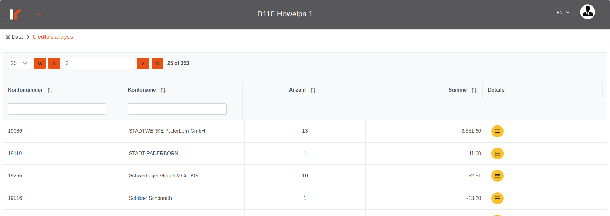

# Venalytics Documentation

## Creditor analysis

Creditor analysis displays the creditor accounts for the selected procedure (account type = ‘K’), and from this table you can get a deep look at each account!

For each account click on the details button to display the details about this account.
