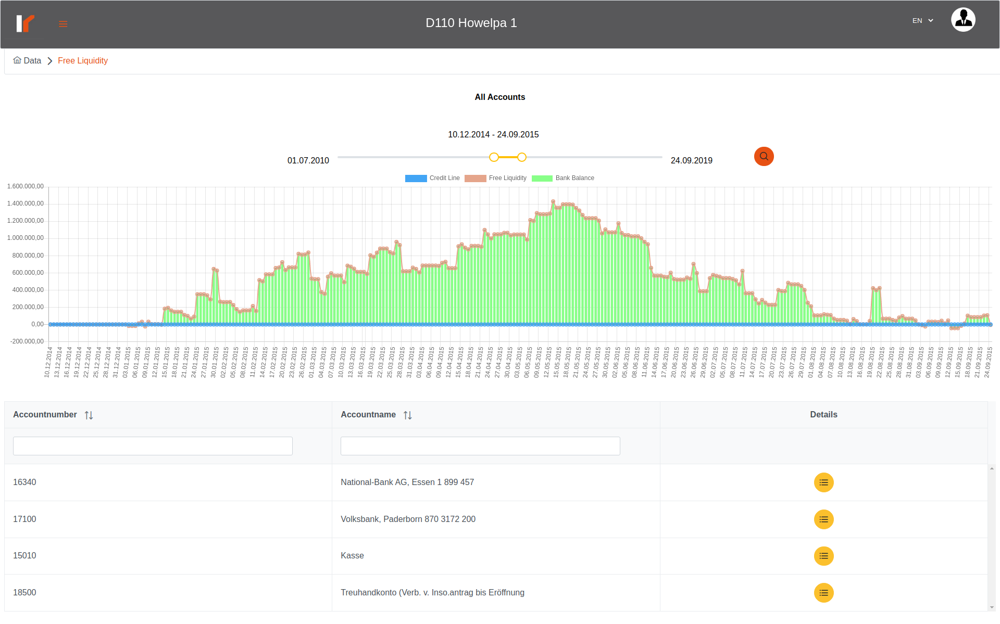

# Venalytics Documentation

## Liquidity analysis

liquidity analysis describes the cash amount (liquidity/ credit limit) in the banks for the selected procedure;
the credit limit for the procedure composed of 2 main parameters: the first is the cash amount in the account and the start date of dealing with this bank; the second parameter is the credit limit which the bank determines for the selected procedure, and it’s vars as a date range.
So for each bank dealing with the selected procedure we have a starting balance and a multiple credit limit/line which we must be specified manually by the admin;
notice that the liquidity analysis will main disabled till the user enter at least on starting balance and one credit line for the selected procedure and set the account type.

### specify starting balance

from the sidebar, under liquidity section, select starting balance; this will display a table contains all of banks accounts, and you can set a starting balance for each account of them;


### specify credit line

to set a credit line, please select credit line from the sidebar, you will see a table contains all the bank accounts and their credit lines for the selected procedure if any exist;

if you set a credit line for a specific bank, then a ‘plus’ button will appears to enable add another credit line for this bank:

and you can reset any credit line by clicking on the trash icon button.
If all previous steps done you can now brows the liquidity analysis.

### Free Liquidity analysis


we can notice the chart above, which can determine the date range so we can focus on it.

You can click on any bar in the chart to get the details about the cash amount in details:

in the new appeared table you can see the total of the bank balances for the selected procedure at the selected day for each bank and the total of all banks.
You can back to previous table by click on the ‘All Accounts’ button.

### Details page

here you can browse the changes for a single bank, and click on any bar in the chart to display the corresponding records for that day.


## Code Reference

### Frontend

the component for the credit lines page is:

```bash
Code/front-end/src/app/shared/liquidity/credit-line/credit-line.component.ts
```

the component for the satrt balancing is:

```bash
Code/front-end/src/app/shared/liquidity/opening-balance/opening-balance.component.ts
```

the component for the main page of the free liquidity analysis is:

```bash
Code/front-end/src/app/shared/liquidity/free-liquidity/free-liquidity.component.ts
```

the component for the details page is:

```bash
Code/front-end/src/app/shared/liquidity/free-liquidity/free-liquidity-details/free-liquidity-details.component.ts
```

all of the previous components use the same service:

```bash
Code/front-end/src/app/shared/service/liquidity.service.ts
```

### Backend

the routes and controller remains in:

```bash
Code/modules/Liquidity/
```

and the repo is:

```bash
Code/repositories/liquidity.analysis.repo.js
```

and the models are:

```bash
// for credit lines
Code/models/creditLines.model.server.js
// for liquidity and start balancing in the posting table
Code/models/posting.model.server.js
```
