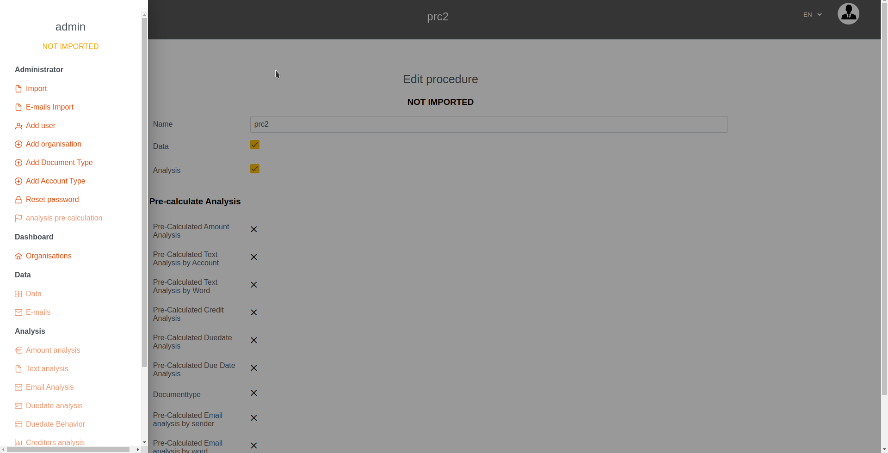
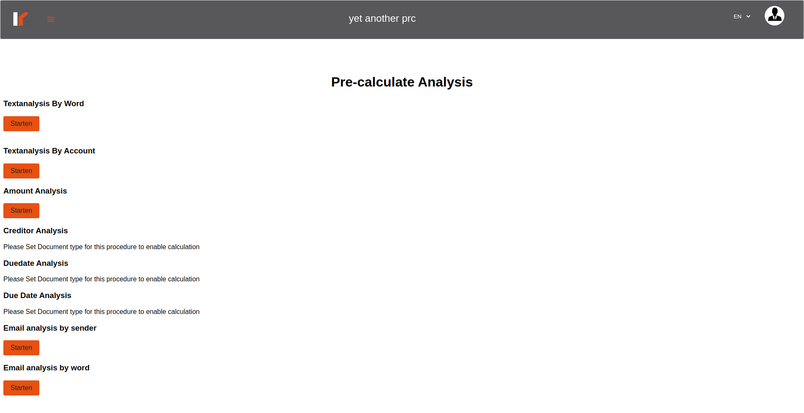
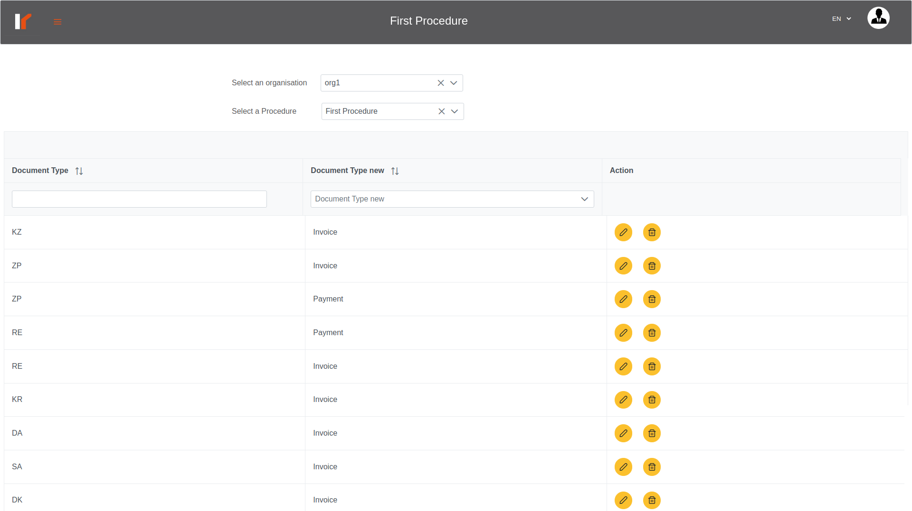

# Venalytics Documentation

## Precalculated list

1. Text analysis by account;
2. Text analyisis by word;
3. Amount analysis;
4. creditor analysis;
5. payment analysis;
6. Due Date analysis;
7. email by word analysis;
8. Email by sender analysis;
9. credit lines for liquidity analysis;

## Calculate analysis

1. first of all, you should select a procedure, from the procedures table, click on show posting data or on edit procedure, then the procedure name will appears on the navbar and the procedure status will appears on the sidebar;

2. noticed that the analysis calculation link is disabled, because the procedure is not imported yet; and will main disabled till the procedure status be `imported` at least;
3. if you select an `imported` procedure, you can calculate some analysis immediately, like text analysis, amount analysis and emails analysis, but some analysis needs actions to be done before you can calculate, like due date analysis;
4. some analysis needs to set document type because the abbreviations like ‘kr’, ‘re’ and ‘kz’ are vars from procedure to another in the meaning, so to be sure of correctness of the analysis these types should be configured by the admin.

5. So before calculate the analysis we suggest to set the document types and the account types for the procedure. And please notice that in calculation we take just the new document type and not the original document type, but for the account type we take them both in liquidity and the original value in the other analysis, so if we want creditors it’s enough that the original account type is ‘K’ (in the analysis) or the new account type is ‘Creditor’ (in liquidity);
6. to set document type or account type, please login as Admin and select it from the sidebar;

7. please not that you select the organization and the procedure here, and nothing to do with the procedure name that displayed in the navbar;
8. after calculating analysis, the calculate button will be disabled;
9. if you want for any reason to recalculate analysis, you can go to edit procedure and set the analysis calculated to false, by clicking the check box, then the calculate button will be enabled again;
10. if you calculate some analysis, the procedure’s status will be ‘partial calculated, and calculate all analysis then the procedure’s status will be ‘calculated’;
11. if the admin want to disable the analysis links, even it calculated then uncheck the ‘analysis’ property in the edit procedure interface;
12. the data property for enable/disable the posting data link in the sidebar;
